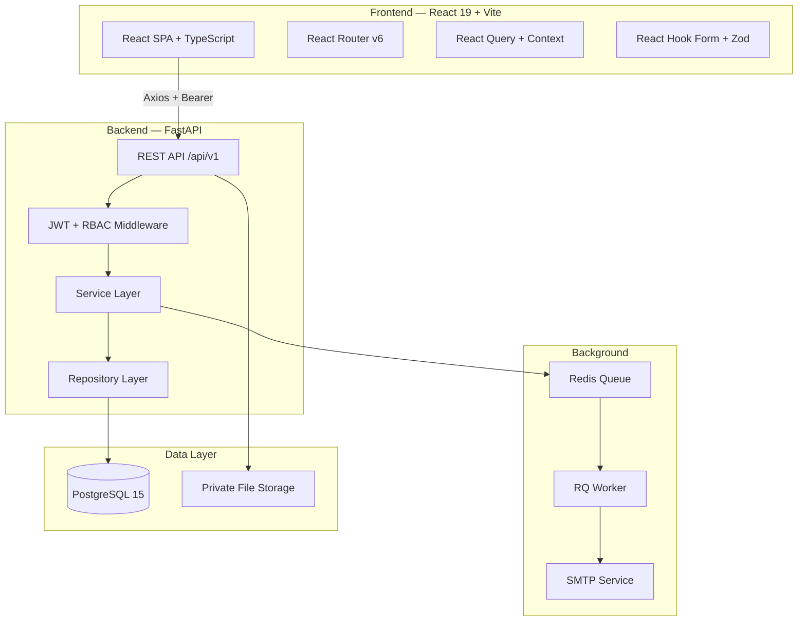
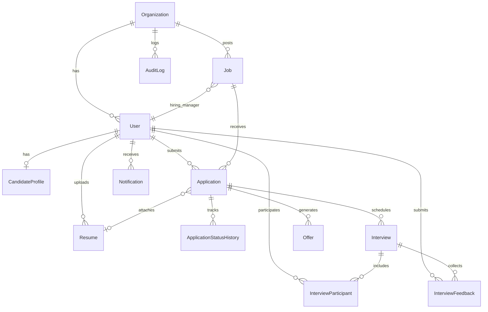
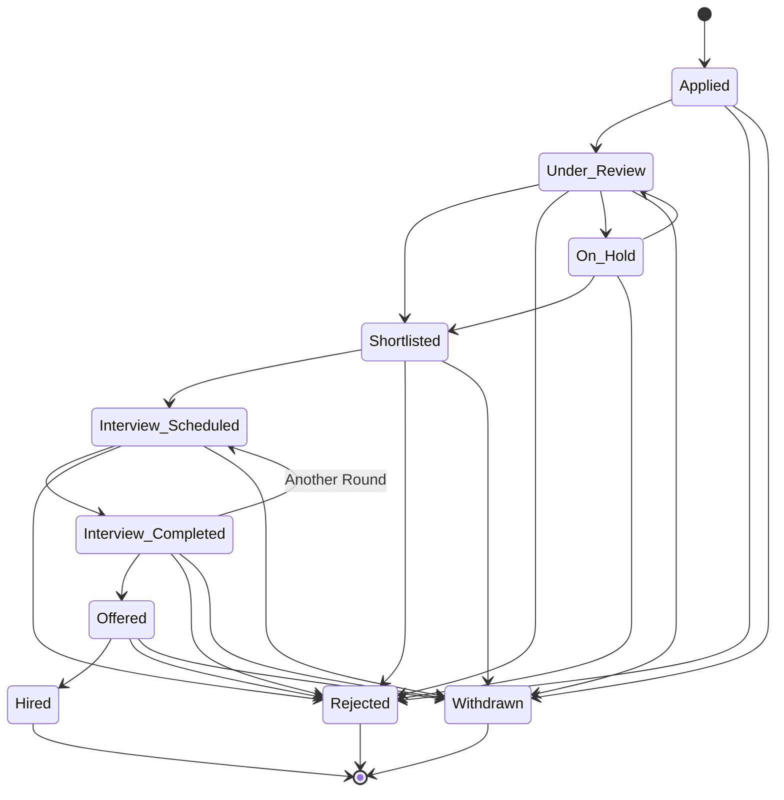

# 🚀 RecruitFlow — Recruitment & Applicant Tracking System

> A full-stack, enterprise-grade Applicant Tracking System (ATS) for managing the complete recruitment lifecycle — from job posting to offer acceptance.

[](https://python.org)
[](https://fastapi.tiangolo.com)
[](https://react.dev)
[](https://typescriptlang.org)
[](https://postgresql.org)
[](LICENSE)

---

## 📋 Problem Statement

Companies often manage recruitment through spreadsheets, emails, and disconnected tools — leading to lost applications, duplicate records, delayed interviews, and difficulty tracking candidate progress. **RecruitFlow** centralizes the entire hiring pipeline into one platform where recruiters, hiring managers, interviewers, and candidates can collaborate effectively.

---

## ✨ Key Features

| Feature | Description |
|---------|-------------|
| 🔐 **Authentication** | JWT + refresh tokens, bcrypt hashing, HTTP-only cookies, role-based access |
| 📋 **Job Management** | Create, publish, pause, close, archive job postings with search & filters |
| 👥 **Candidate Profiles** | Skills, education, experience, resume management |
| 📄 **Resume Upload** | PDF/DOCX with MIME validation, magic bytes check, text extraction |
| 🔄 **Application Pipeline** | Applied → Review → Shortlisted → Interview → Offered → Hired |
| 📅 **Interview Scheduling** | Conflict detection, panel support, timezone-aware timestamps |
| ⭐ **Scorecards** | Structured interview feedback with configurable criteria |
| 💰 **Offer Management** | Draft → Approval → Send → Accept/Decline workflow |
| 📊 **Dashboard** | Real database-backed metrics and recruitment funnel |
| 📧 **Email Notifications** | Async SMTP with templates, retry logic, delivery tracking |
| 🔍 **Audit Logging** | Immutable record of all important actions |
| 🏢 **Multi-tenant** | Organization-level data isolation |

---

## 🏗 System Architecture



---

## 🗄 Database ER Diagram



---

## 🛡 User Roles

| Role | Permissions |
|------|------------|
| **Admin** | Full system access, user management, org settings, audit logs |
| **Recruiter** | Job CRUD, application review, interview scheduling, offers |
| **Hiring Manager** | View assigned jobs, shortlist/reject, interview feedback |
| **Interviewer** | View assigned interviews, submit scorecards |
| **Candidate** | Browse jobs, apply, track applications, manage profile |

All permissions are enforced on the backend. Frontend UI hiding alone is not considered security.

---

## 🔄 Application Workflow



---

## 🛠 Technology Stack

### Backend
- **Runtime:** Python 3.12+
- **Framework:** FastAPI 0.115
- **ORM:** SQLAlchemy 2.0 (async)
- **Database:** PostgreSQL 15
- **Migrations:** Alembic
- **Auth:** JWT (PyJWT) + bcrypt
- **Queue:** Redis + RQ
- **Email:** aiosmtplib + Jinja2

### Frontend
- **Runtime:** Node.js 20
- **Framework:** React 19 + Vite
- **Language:** TypeScript 5
- **Styling:** Tailwind CSS v4
- **Routing:** React Router v6
- **Forms:** React Hook Form + Zod
- **HTTP:** Axios
- **Icons:** Lucide React
- **Charts:** Recharts

### Infrastructure
- **Containerization:** Docker + Docker Compose
- **Database:** PostgreSQL (Docker / managed)
- **Cache/Queue:** Redis

---

## 📁 Project Structure

```
recruitflow/
├── frontend/                  # React + Vite + TypeScript
│   ├── src/
│   │   ├── components/        # Reusable UI components
│   │   ├── hooks/             # Custom hooks (auth, etc.)
│   │   ├── layouts/           # Page layouts
│   │   ├── pages/             # Route page components
│   │   ├── services/          # API client
│   │   ├── types/             # TypeScript types
│   │   ├── App.tsx            # Router configuration
│   │   └── index.css          # Global styles + Tailwind
│   ├── package.json
│   └── Dockerfile
├── backend/                   # FastAPI + Python
│   ├── app/
│   │   ├── api/v1/            # API endpoint modules
│   │   ├── core/              # Config, database, security
│   │   ├── models/            # SQLAlchemy models
│   │   ├── schemas/           # Pydantic schemas
│   │   ├── services/          # Email, background jobs
│   │   ├── main.py            # FastAPI app entry
│   │   └── seed.py            # Demo data seeder
│   ├── migrations/            # Alembic migrations
│   ├── requirements.txt
│   └── Dockerfile
├── docker-compose.yml
├── .env.example
├── .gitignore
├── LICENSE
└── README.md
```

---

## 🚀 Getting Started

### Prerequisites

- Docker & Docker Compose (recommended)
- OR: Python 3.12+, Node.js 20+, PostgreSQL 15, Redis

### Quick Start with Docker

```bash
# 1. Clone the repository
git clone https://github.com/yourusername/recruitflow.git
cd recruitflow

# 2. Create environment file
cp .env.example .env

# 3. Start all services
docker compose up -d

# 4. Run database migrations
docker compose exec backend alembic upgrade head

# 5. Seed demo data
docker compose exec backend python -m app.seed
```

The app will be available at:
- **Frontend:** http://localhost:5173
- **Backend API:** http://localhost:8000
- **API Docs:** http://localhost:8000/docs

### Manual Setup

```bash
# Backend
cd backend
python -m venv .venv
source .venv/bin/activate  # Windows: .venv\Scripts\activate
pip install -r requirements.txt
alembic upgrade head
python -m app.seed
uvicorn app.main:app --reload

# Frontend
cd frontend
npm install
npm run dev
```

### Running Tests

```bash
# Backend test suite (22 tests with async in-memory SQLite)
cd backend
pytest -v

# Frontend component test suite (Vitest + Testing Library)
cd frontend
npm test
```

---

## 🔑 Environment Configuration

Copy `.env.example` to `.env` and configure:

| Variable | Description | Default |
|----------|-------------|---------|
| `DATABASE_URL` | PostgreSQL connection string | `postgresql+asyncpg://...` |
| `JWT_SECRET_KEY` | Secret for JWT signing | **Must change in production** |
| `SMTP_HOST` | Email server hostname | `localhost` |
| `UPLOAD_DIRECTORY` | Resume storage path | `./uploads` |
| `REDIS_URL` | Redis connection string | `redis://localhost:6379/0` |
| `CORS_ORIGINS` | Allowed frontend origins | `http://localhost:5173` |

See `.env.example` for the complete list.

---

## 📡 API Documentation

The API is documented via FastAPI's auto-generated OpenAPI spec:

- **Swagger UI:** http://localhost:8000/docs
- **ReDoc:** http://localhost:8000/redoc

### Key Endpoints

| Method | Endpoint | Description |
|--------|----------|-------------|
| POST | `/api/v1/auth/register` | Candidate registration |
| POST | `/api/v1/auth/login` | Login (returns JWT) |
| GET | `/api/v1/jobs/public` | Public careers listing |
| POST | `/api/v1/jobs` | Create job (staff) |
| POST | `/api/v1/applications/jobs/{id}/apply` | Apply for job |
| PATCH | `/api/v1/applications/{id}/status` | Update status |
| POST | `/api/v1/interviews/applications/{id}/schedule` | Schedule interview |
| POST | `/api/v1/interviews/{id}/feedback` | Submit scorecard |
| POST | `/api/v1/offers/applications/{id}/offers` | Create offer |
| GET | `/api/v1/dashboard/overview` | Dashboard metrics |

---

## 🧪 Demo Credentials

| Role | Email | Password |
|------|-------|----------|
| Admin | admin@recruitflow.dev | Demo1234! |
| Recruiter | recruiter@recruitflow.dev | Demo1234! |
| Hiring Manager | manager@recruitflow.dev | Demo1234! |
| Interviewer | interviewer@recruitflow.dev | Demo1234! |
| Candidate | alex@example.com | Demo1234! |

---

## 🔒 Security Considerations

- **Backend-enforced RBAC** — every endpoint validates user role and resource access
- **Organization isolation** — staff can only see their organization's data
- **Private resume storage** — files stored with unique keys, downloads require authorization
- **Password hashing** — bcrypt with 12 rounds
- **JWT security** — access + refresh tokens, HTTP-only cookies in production
- **Input validation** — Pydantic on backend, Zod on frontend
- **File validation** — extension, MIME type, magic bytes, size limits
- **CORS** — configurable allowed origins
- **No sensitive data exposure** — password hashes, reset tokens, internal notes filtered from responses

---

## 📈 Future Enhancements

- [ ] Google Calendar / Outlook integration
- [ ] AI-powered resume parsing
- [ ] Team collaboration and @mentions
- [ ] Custom pipeline stages
- [ ] Advanced analytics and reporting
- [ ] Bulk candidate import
- [ ] Multi-language support
- [ ] Mobile application

---

## 📄 License

This project is licensed under the MIT License — see the [LICENSE](LICENSE) file for details.

---

<p align="center">
  Built with ❤️ as a portfolio project showcasing full-stack development skills
</p>
